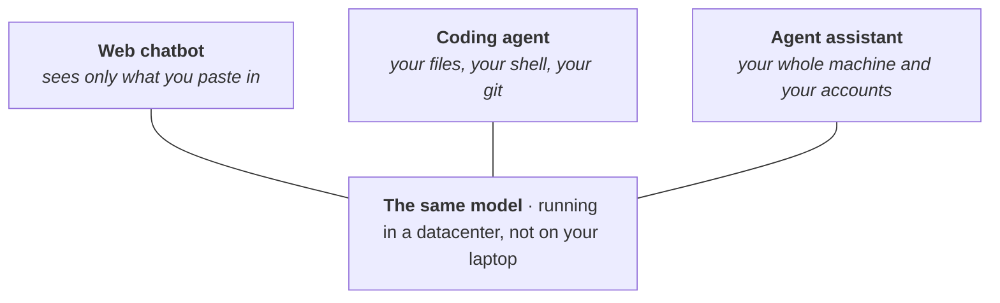

# Large Language Models & Agent Tools

!!! danger "Draft · not yet reviewed by a human"
    This page was drafted by an AI agent and has not finished human review. Treat everything on it, including the linked sources, as provisional until this notice is removed.

This is the first page of the roadmap on purpose. Not because these tools are exciting, but because they change what everything after them costs you. A question that used to mean a week of fighting with someone else's code can now be a conversation, and the bottleneck moves from "can I write the code" to "do I understand the problem." So this page is a map: why the tools are worth your time, what the confusingly similar ones actually are, how to start, and how to use them to amplify what you can do.

## Why this comes first

A coding agent is a program that takes a goal in plain language, then reads files, runs commands, and edits code on its own until the goal is met or it gets stuck. Paired with the command line and git, it turns the terminal from a wall into something you can talk to.

This matters whether you do experiments or write code, for two reasons. First, a coding agent runs anywhere, not only in a folder full of code. [Anthropic's docs](https://code.claude.com/docs/en/common-workflows) point out it works as well in a folder of notes or manuscripts as in a repository, and this site, including the page you are reading, was written that way. There is a walk-through in [Writing This Site With Claude Code](../7-how-to/7.1-llm-agents/7.1.1-writing-with-claude-code.md). Second, the barrier really does seem to be understanding rather than coding. Across roughly 400,000 sessions, [Anthropic found](https://www.anthropic.com/research/claude-code-expertise) that domain expertise, not coding skill, was what separated people who got useful results from people who did not. That number comes from the company selling the tool and rests on a metric they designed, so take it with a grain of salt. The independent version of the same signal: in January 2026, MIT dedicated a session of [Missing Semester](https://missing.csail.mit.edu/) to agentic coding. A university opening a course on a topic says plenty about how much it matters.

For this lab, these tools are already a must-learn. [Claude Science](https://claude.com/product/claude-science), out in mid-2026, ships tools for genomics, single-cell, and structural biology, and it drives jobs on an HPC cluster over SSH, submitting them with `sbatch` instead of running them on the login node. Whether or not you use that product, expect tools like it to become more and more common.

## Three tools that look alike

The most useful thing to sort out early: "chatbot," "coding agent," and things like OpenClaw look like three products of the same kind. They are not. They are the same model wearing three different amounts of clothing. The model is identical, and in every case it runs in a datacenter rather than on your laptop. What changes is the harness around it, meaning the tools it can call and the things it is allowed to touch.

*Figure: one model, three harnesses. Left to right, the harness reaches more of your world, which is the same axis as both the usefulness and the risk.*

| | Web chatbot | Coding agent | Agent assistant |
| --- | --- | --- | --- |
| For example | claude.ai, ChatGPT | Claude Code, Codex CLI | OpenClaw |
| Where the harness runs | vendor's server, in a browser tab | your machine, a terminal or editor | your machine, in the background |
| What it can reach | only what you paste in | your working folder, shell, and git | your whole machine and your accounts |
| Does it loop? | no, one reply per message | yes, runs tools until the job is done | yes, and can start a turn on its own |
| Can you undo it? | nothing to undo | yes, through git | not by default |

The taxonomy earns its keep because those same properties predict both the power and the danger. A chatbot cannot delete your files because it cannot see them. A coding agent can, which is exactly why running it inside git matters: every change it makes is a diff you can read and revert. An agent assistant like [OpenClaw](https://github.com/openclaw/openclaw) goes further, wiring the model into your mail, chat, and calendar so it can act without you starting each turn. That is where things are heading, but tools in this category are still immature: get to know them gradually, and use them with care.

For the concepts underneath all this, Simon Willison's [one-line definition of an agent](https://simonwillison.net/2025/Sep/18/agents/) ("an LLM agent runs tools in a loop to achieve a goal") and Anthropic's [Building Effective Agents](https://www.anthropic.com/engineering/building-effective-agents) are the two clearest short reads. In Chinese, the video [一口气拆穿 Skill/MCP/RAG/Agent 底层逻辑](https://www.bilibili.com/video/BV1ojfDBSEPv/) does the same in fifteen minutes, and it aims straight at the real problem, which is that everyone uses these words and nobody defines them.

## Getting your hands on one

Getting started is simple: open a terminal and install one. Anthropic's [setup guide](https://code.claude.com/docs/en/setup) walks you through it, the [Quickstart](https://code.claude.com/docs/en/quickstart) takes you from install to a first real edit, and the [terminal guide](https://code.claude.com/docs/en/terminal-guide) is there for anyone who has never used a command line.

Claude Code is not the only choice. Tools like Kimi Code and Zhipu's [Z Code](https://zcode.z.ai/) work much the same way; Kimi Code installs with a single command (`curl -fsSL https://code.kimi.com/kimi-code/install.sh | bash`) and starts with `kimi`. The concepts and habits on this page transfer across all of them, so picking one and getting good at it matters more than picking the perfect one.

The terminal is still worth learning properly, because git and the cluster live there, and it is the line between watching the agent work and being able to check it. If you want to go deeper, [Linux, Git & GitHub Basics](1.2-linux-git.md) covers the shell and version control, and [Python Basics](1.3-python.md) covers the language most of the lab's analysis is written in.

One practical note: the capable coding agents are paid, but the money is well spent, and the lab fully supports members spending on these tools.

## Talking to it well

Most people arrive from chatbots with the instinct to write one careful, detailed instruction and hope. With an agent that is close to backwards, and two habits matter more than any amount of prompt phrasing.

The first is to delegate rather than dictate. Hand it the whole project and a goal and let it open files, search, and try things, instead of pasting snippets into a box and describing what you want done to them. It was trained on exactly the kind of poking-around the terminal allows, and it does far more when you let it look than when you narrate.

The second is to give it something it can check itself against. An agent stops when the work looks done, so a test to run or a build to pass keeps it going until the check is green, rather than leaving you to be the error message. That single habit buys more reliability than any wording trick.

For the details, three resources are enough. Anthropic's [prompting best practices](https://platform.claude.com/docs/en/build-with-claude/prompt-engineering/overview) is the canonical reference and shorter than you would guess. The [Claude Code best practices](https://www.anthropic.com/engineering/claude-code-best-practices) post has before-and-after examples and one trick worth stealing: ask the agent to interview you about a task and write the spec down before it starts. If you would rather learn the mindset than the syntax, Anthropic Academy's free [AI Fluency](https://anthropic.skilljar.com/ai-fluency-framework-foundations) course is built around delegation and judgment instead of prompt recipes. Anything, in any language, that sells a list of magic phrases is safe to skip; on current models that material is mostly obsolete.

## The words you'll keep hearing

A small vocabulary comes up over and over. None of it needs to be understood deeply to start, and trying to master it first is a good way to stall. One line each, and where to go when a word starts getting in your way.

| Concept | What it is | Start here |
| --- | --- | --- |
| Model & effort | Which model runs, and how hard it works before answering. Reach for a bigger model when it understood the task and still got it wrong; raise effort when it was careless. | [Choosing a model and effort](https://claude.com/blog/claude-model-and-effort-level-in-claude-code) |
| Context window | Everything the model can see at once. It fills up over a long session, and quality drops when it does. | [Explore the context window](https://code.claude.com/docs/en/context-window) |
| Skills | A folder that teaches an agent a procedure, loaded only when it is needed. Now a shared standard several tools read. | [agentskills.io](https://agentskills.io) |
| MCP | One common plug for connecting an agent to outside systems like a database. Now stewarded by the Linux Foundation, not Anthropic. | [modelcontextprotocol.io](https://modelcontextprotocol.io/docs/getting-started/intro) |
| Subagents | A helper that does a noisy side job in its own context and reports back a summary, so the main thread stays clean. | [Claude Code docs](https://code.claude.com/docs/en/sub-agents) |

The lab keeps its own Skills, packaged as a Claude Code plugin, over on [Routine Lab Support](../5-lab-code/5.1-routine-support.md). Once you are comfortable, that is where the tools stop being generic and start knowing about our data.

## Learning it systematically

If you want to learn it systematically through a course, the one to take is DeepLearning.AI's short course [Claude Code: A Highly Agentic Coding Assistant](https://www.deeplearning.ai/courses/claude-code-a-highly-agentic-coding-assistant), built with Anthropic and taught by its head of technical education. It runs from CLAUDE.md and context management all the way to subagents, hooks, and MCP, with three full project exercises along the way; some Python and git helps. The full videos are also [mirrored on Bilibili](https://www.bilibili.com/video/BV1RSFUzVEAG).

## Further reading

- [Building Effective Agents](https://www.anthropic.com/engineering/building-effective-agents): the best short case for keeping agent setups simple, and it reads well once the vocabulary above has stopped being a fog.
- [learn.shareai.run](https://learn.shareai.run/zh/): a natively Chinese course on why Claude Code behaves the way it does. Deep, close to a source-code-level dissection of Claude, for when you want the principles.
- MIT's [Missing Semester](https://missing.csail.mit.edu/), the January 2026 session: dedicated to agentic coding, and a good way to walk the whole toolchain end to end.
- The official docs are what you will keep coming back to: [Claude Code docs](https://code.claude.com/docs/en/overview), [Kimi Code docs](https://www.kimi.com/code/docs/en/), [Z Code docs](https://zcode.z.ai/cn).
