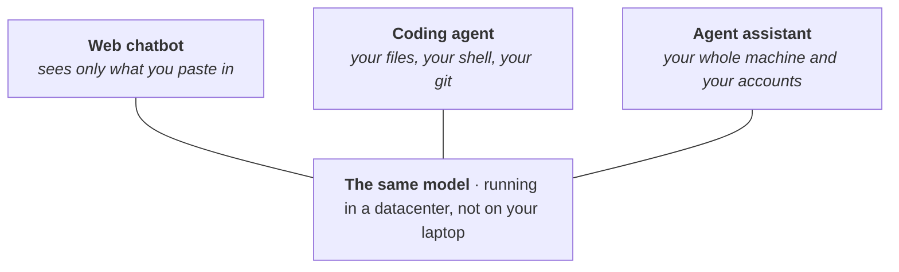

# Large Language Models & Agent Tools

This is the first page of the roadmap on purpose. Not because these tools are exciting, but because they change what everything after them costs you. A question that used to mean a week of fighting with someone else's code can now be a conversation, and the bottleneck moves from "can I write the code" to "do I understand the problem." So this page is a map: why the tools are worth your time, what the confusingly similar ones actually are, how to start, and how to use them without quietly wrecking your own science.

## Why this comes first

A coding agent is a program that takes a goal in plain language, then reads files, runs commands, and edits code on its own until the goal is met or it gets stuck. Paired with the command line and git, it turns the terminal from a wall into something you can talk to.

Two things make that matter for someone from the wet lab rather than for a programmer. First, a coding agent runs anywhere, not only in a folder full of code. [Anthropic's docs](https://code.claude.com/docs/en/common-workflows) point out it works as well in a folder of notes or manuscripts as in a repository, and this site, including the page you are reading, was written that way. There is a walk-through in [Writing This Site With Claude Code](../7-how-to/7.1-llm-agents/7.1.1-writing-with-claude-code.md). Second, the barrier really does seem to be understanding rather than coding. Across roughly 400,000 sessions, [Anthropic found](https://www.anthropic.com/research/claude-code-expertise) that domain expertise, not coding skill, was what separated people who got useful results from people who did not. That number comes from the company selling the tool and rests on a metric they designed. The independent version of the same signal: MIT rebuilt its [*Missing Semester*](https://missing.csail.mit.edu/2026/agentic-coding/) course in January 2026 around these tools, which universities tend to do only once something has stopped being a novelty.

For this lab the work is already arriving at the door. [Claude Science](https://claude.com/product/claude-science), out in mid-2026, ships tools for genomics, single-cell, and structural biology, and it drives jobs on an HPC cluster over SSH, submitting them with `sbatch` instead of running them on the login node. You do not have to use that product to read the direction it points.

None of this means the tools are good at biology yet. They are not, and the last section is an honest look at where they fall down. It is the part to read before leaning on anything one of them tells you.

## Three tools that look alike

The most useful thing to sort out early: "chatbot," "coding agent," and things like OpenClaw are not three products competing for the same job. They are the same model wearing three different amounts of clothing. The model is identical, and in every case it runs in a datacenter rather than on your laptop. What changes is the harness around it, meaning the tools it can call and the things it is allowed to touch.

*Figure: one model, three harnesses. Left to right, the harness reaches more of your world, which is the same axis as both the usefulness and the risk.*

| | Web chatbot | Coding agent | Agent assistant |
| --- | --- | --- | --- |
| For example | claude.ai, ChatGPT | Claude Code, Codex CLI | OpenClaw |
| Where the harness runs | vendor's server, in a browser tab | your machine, a terminal or editor | your machine, in the background |
| What it can reach | only what you paste in | your working folder, shell, and git | your whole machine and your accounts |
| Does it loop? | no, one reply per message | yes, runs tools until the job is done | yes, and can start a turn on its own |
| Can you undo it? | nothing to undo | yes, through git | not by default |

The taxonomy earns its keep because those same properties predict both the power and the danger. A chatbot cannot delete your files because it cannot see them. A coding agent can, which is exactly why running it inside git matters: every change it makes is a diff you can read and revert. An agent assistant like [OpenClaw](https://github.com/openclaw/openclaw) goes further, wiring the model into your mail, chat, and calendar so it can act without you starting each turn. That is where things are heading, and it is also the category with the largest blast radius, which is why it is not a first-week tool and not something to point at the laptop holding your lab's data.

For the concepts underneath all this, Simon Willison's [one-line definition of an agent](https://simonwillison.net/2025/Sep/18/agents/) ("an LLM agent runs tools in a loop to achieve a goal") and Anthropic's [Building Effective Agents](https://www.anthropic.com/engineering/building-effective-agents) are the two clearest short reads. In Chinese, the video [一口气拆穿 Skill/MCP/RAG/Agent 底层逻辑](https://www.bilibili.com/video/BV1ojfDBSEPv/) does the same in fifteen minutes, and it aims straight at the real problem, which is that everyone uses these words and nobody defines them.

## Getting your hands on one

You do not need the terminal to start. If a black window with no buttons is a wall, the desktop app and the editor extensions skip it entirely for your first hour, and Anthropic's [setup guide](https://code.claude.com/docs/en/setup) points you to them. The [Quickstart](https://code.claude.com/docs/en/quickstart) takes you from install to a first real edit, and the [terminal guide](https://code.claude.com/docs/en/terminal-guide) is there for anyone who has never used a command line.

The terminal is worth learning anyway, because git and the cluster live there, and it is the line between watching the agent work and being able to check it. That is a page of its own: [Linux, Git & GitHub Basics](1.2-linux-git.md) for the shell and version control, and [Python Basics](1.3-python.md) for the language most of the lab's analysis is written in. A biology-flavoured way into the command line is Data Carpentry's [shell-genomics](https://datacarpentry.github.io/shell-genomics/), where every example is a real FASTQ file; in Chinese, the [中文版 Shell 课](https://missing-semester-cn.github.io/2020/course-shell/) and 阮一峰's [Bash 脚本教程](https://wangdoc.com/bash/) cover the same ground.

One practical note that has nothing to do with geography: the capable coding agents are paid, and a lot of universities now hand out access through your `.edu` address, so that is worth checking before you pay for it yourself.

## Talking to it well

Most people arrive from chatbots with the instinct to write one careful, detailed instruction and hope. With an agent that is close to backwards, and two habits matter more than any amount of prompt phrasing.

The first is to delegate rather than dictate. Hand it the whole project and a goal and let it open files, search, and try things, instead of pasting snippets into a box and describing what you want done to them. It was trained on exactly the kind of poking-around the terminal allows, and it does far more when you let it look than when you narrate.

The second is to give it something it can check itself against. An agent stops when the work looks done, so a test to run or a build to pass keeps it going until the check is green, rather than leaving you to be the error message. That single habit buys more reliability than any wording trick.

For the details, three resources are enough. Anthropic's [prompting best practices](https://platform.claude.com/docs/en/build-with-claude/prompt-engineering/overview) is the canonical reference and shorter than you would guess. The [Claude Code best practices](https://www.anthropic.com/engineering/claude-code-best-practices) post has before-and-after examples and one trick worth stealing: ask the agent to interview you about a task and write the spec down before it starts. If you would rather learn the mindset than the syntax, Anthropic Academy's free [AI Fluency](https://anthropic.skilljar.com/ai-fluency-framework-foundations) course is built around delegation and judgment instead of prompt recipes. Anything, in any language, that sells a list of magic phrases is safe to skip; on current models that material is mostly obsolete.

## The words you'll keep hearing

A small vocabulary comes up over and over. None of it needs to be understood deeply to start, and trying to master it first is a good way to stall. One line each, and where to go when a word starts getting in your way.

| Concept | What it is | Start here |
| --- | --- | --- |
| Model & effort | Which model runs, and how hard it works before answering. Reach for a bigger model when it understood the task and still got it wrong; raise effort when it was careless. | [Choosing a model and effort](https://claude.com/blog/claude-model-and-effort-level-in-claude-code) |
| Context window | Everything the model can see at once. It fills up over a long session, and quality drops when it does. | [Explore the context window](https://code.claude.com/docs/en/context-window) |
| Skills | A folder that teaches an agent a procedure, loaded only when it is needed. Now a shared standard several tools read. | [agentskills.io](https://agentskills.io) |
| MCP | One common plug for connecting an agent to outside systems like a database. Now stewarded by the Linux Foundation, not Anthropic. | [modelcontextprotocol.io](https://modelcontextprotocol.io/docs/getting-started/intro) |
| Subagents | A helper that does a noisy side job in its own context and reports back a summary, so the main thread stays clean. | [Claude Code docs](https://code.claude.com/docs/en/sub-agents) |

The lab keeps its own Skills, packaged as a Claude Code plugin, over on [Routine Lab Support](../5-lab-code/5.1-routine-support.md). Once you are comfortable, that is where the tools stop being generic and start knowing about our data.

## Using it like a scientist

The reason to learn this well is to think more, not less. 授人以鱼不如授人以渔: you bring an agent in to answer your questions faster and to explain the things you do not follow, not to hand over the reasoning and paste back whatever comes out. The evidence that the difference is real is unusually clean. In a field experiment in Turkish high schools, students who practised with a plain chatbot did worse on their own once it was taken away, while students given a version deliberately held back to tutoring rather than answering lost nothing ([Bastani et al., *PNAS* 2025](https://pmc.ncbi.nlm.nih.gov/articles/PMC12232635/)); in a separate Harvard trial, that tutoring version outlearned a well-run active class ([Kestin et al., *Scientific Reports* 2025](https://www.nature.com/articles/s41598-025-97652-6)). Same model, good teacher or bad crutch, decided entirely by how it was set up. The lab's habit is the tutoring setup: make it explain rather than just produce, let it quiz you, and read every diff before keeping it.

The failures worth watching for are the quiet ones. An agent gives no signal when it is guessing; a wrong answer arrives with exactly the confidence of a right one. Three of these matter most for a scientist.

It is weakest where the internet is thinnest about your field. On a single-cell RNA-seq benchmark in early 2026 ([scBench](https://arxiv.org/abs/2602.09063)), accuracy fell by more than forty points on the less-documented assays. The picture to hold onto is one every biologist already carries: close to a third of papers with gene lists in supplementary Excel files have corrupted names ([Abeysooriya et al., *PLOS Comput. Biol.* 2021](https://journals.plos.org/ploscompbiol/article?id=10.1371/journal.pcbi.1008984)), because *SEPT2* quietly turned into a date and the sheet still looked fine. The risk has that shape, and it does not announce itself.

It agrees with you. Across eleven frontier models, an agent affirmed the user's stated position far more often than a person would, and people rated the flattering answer as the better one ([Cheng et al., *Science* 2026](https://www.science.org/doi/10.1126/science.aec8352)). For a student attached to a hypothesis this is the hardest failure to catch, because agreement feels the same as being right.

It invents sources. Fabricated citations are now measurable in the published literature and climbing, up to about one in 277 PubMed-indexed papers in early 2026 ([*The Lancet*, 2026](https://www.thelancet.com/journals/lancet/article/PIIS0140-6736%2826%2900603-3/fulltext)). So the boring habit is the one to keep: check every DOI before it goes into a document, and read the paper before citing it.

Two more guards, beyond your own vigilance. One is what you feed it: unpublished data, a collaborator's manuscript, and controlled-access genomic data have no business in a personal account, where the default terms may train on your inputs. NIH's [NOT-OD-25-081](https://grants.nih.gov/grants/guide/notice-files/NOT-OD-25-081.html) is explicit that handing controlled-access data to a public AI tool breaks the data-use agreement. The other is the standard you will be held to when you publish: journals following [ICMJE](https://www.icmje.org/recommendations/browse/artificial-intelligence/) guidance want AI use disclosed and put the responsibility on you, not the tool, for everything you submit. The bioinformatics [nf-core statement on AI](https://nf-co.re/blog/2026/statement-on-ai) says it in a line worth borrowing: the human using the tool stays responsible for the code they submit.

One honest note in the other direction. The feeling of going faster is not data. In a randomised trial, experienced open-source developers were measurably slower with AI on code they knew well, even as they came away sure it had sped them up ([METR, 2025](https://metr.org/blog/2025-07-10-early-2025-ai-experienced-os-dev-study/)). The tooling there is old now and the result is argued over, but the gap between the feeling and the stopwatch is the part that lasts. The number to trust is the check, not the feeling.

## Further reading

[Building Effective Agents](https://www.anthropic.com/engineering/building-effective-agents) is the best short case for keeping agent setups simple, and it reads well once the vocabulary above has stopped being a fog. For a deeper, natively Chinese course on why agents behave the way they do, [learn.shareai.run](https://learn.shareai.run/zh/) is the strongest one going, though it assumes you can already write Python. 李宏毅's [2026 machine learning lectures](https://speech.ee.ntu.edu.tw/~hylee/ml/2026-spring.php) include two sessions on AI agents pointed right at how research work is changing.
