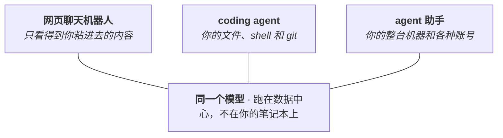

# 大语言模型与 Agent 工具应用

!!! danger "草稿 · 尚未经过人工审阅"
    本页由 AI agent 自动生成，尚未完成人工改进。在此提示移除之前，页面上的所有内容（包括引用的资料）都请当作暂定版本看待。

把这一页放在整个学习路线的第一站，是有意安排的。倒不是因为这些工具时髦，而是它们实实在在改变了后面每一样学习的代价。过去遇到一个问题，可能得跟别人的代码耗上一个星期，如今很多时候就是一场对话的事。真正卡脖子的地方，于是从"能不能把代码写出来"挪到了"有没有把问题想明白"。接下来我们会简单聊聊：这类工具为什么值得花功夫学，几个名字长得很像的东西分别是什么，从哪里上手，以及怎么用它放大自己的能力。

## 为什么它是第一项基础技能

coding agent 是这样一类程序：你用大白话交代一个目标，它就自己去读文件、跑命令、改代码，一直干到目标达成，或者干不下去为止。再配上命令行和 git，那个原本让人望而生畏的黑色窗口，就成了一个可以商量事情的伙伴。

这件事不管对做实验的还是写程序的，意义都很大，理由有两个。一是 coding agent 不挑地方，不是非得待在代码仓库里才能干活。[Anthropic 的文档](https://code.claude.com/docs/zh-CN/common-workflows)特意提到，一个装满笔记和手稿的文件夹，对它来说同样好用。这个网站，包括你正在看的这一页，就是这么写出来的，具体过程记在[用 Claude Code 写这个网站](../7-how-to/7.1-llm-agents/7.1.1-writing-with-claude-code.md)。二是真正的门槛多半不在写代码，而在理解。[Anthropic 分析了](https://www.anthropic.com/research/claude-code-expertise)大约 40 万次会话后发现，把用得好和用不好的人区分开的，是各自领域的专业功底，而不是编程水平。MIT 在 2026 年 1 月开了一期专门讲 agentic coding 的[《Missing Semester》](https://missing.csail.mit.edu/)，能为这个话题专门开一门课，本身就说明它确实重要。

对咱们实验室来说，这些工具已经是必须掌握的东西。2026 年年中发布的 [Claude Science](https://claude.com/product/claude-science) 自带基因组学、单细胞、结构生物学的工具，还能通过 SSH 操作 HPC 集群，用 `sbatch` 提交作业，而不是图省事在登录节点上直接跑。用不用这个产品另说，可以预见，这类工具以后会越来越普及。<!-- 批注：这里提一下 Edison Science 的 ai scientists -->

## 三样长得很像的东西

刚开始最值得理清的一件事："聊天机器人""coding agent"，再加上 OpenClaw 那一类，看起来是三个同类型的产品，其实不是。它们是同一个模型穿了三件厚薄不同的外衣。模型是同一个，而且不管套哪件外衣，它都跑在数据中心里，不在你的电脑上。真正变的是外面那层 harness（外壳），也就是它能调用哪些工具、被允许碰到你手上的哪些东西。

*图：一个模型，三层外壳。从左到右，外壳能碰到的东西越来越多，本事和风险长在同一条轴上。*

| | 网页聊天机器人 | coding agent | agent 助手 |
| --- | --- | --- | --- |
| 举例 | claude.ai、ChatGPT | Claude Code、Codex CLI | OpenClaw |
| 外壳跑在哪儿 | 厂商的服务器上，你只开一个浏览器标签页 | 你的机器上，终端或编辑器里 | 你的机器上，在后台运行 |
| 能碰到什么 | 只有你粘进去的东西 | 你的工作目录、shell 和 git | 你整台机器和各种账号 |
| 会不会循环 | 不会，一条消息换一个回复 | 会，一直调工具到把活干完 | 会，还能自己发起一轮 |
| 能不能撤销 | 没什么可撤的 | 能，靠 git | 默认不能 |

这个分类法值得记住，因为表里这几条属性，既决定了本事大小，也决定了闯祸规模。聊天机器人删不掉你的文件，因为它根本看不见；coding agent 看得见也动得了，所以才一定要在 git 里用它，这样它的每一处改动都是一段 diff，你能逐行读，也能一键退回。[OpenClaw](https://github.com/openclaw/openclaw) 这类 agent 助手走得更远，把模型接进邮件、聊天和日历，不用等你发话就能自己动手。方向确实是朝那边走的，不过这类工具眼下还不成熟，可以慢慢了解，用的时候多留个心眼。

想把底下的概念弄清楚，有两篇短文最省事：Simon Willison 给 agent 下的[一句话定义](https://simonwillison.net/2025/Sep/18/agents/)（agent 就是让大模型在循环里调用工具去达成目标），以及 Anthropic 的 [Building Effective Agents](https://www.anthropic.com/engineering/building-effective-agents)。中文材料里，[一口气拆穿 Skill/MCP/RAG/Agent 底层逻辑](https://www.bilibili.com/video/BV1ojfDBSEPv/)这个视频用十五分钟讲了同样的事，而且直击要害：这些词人人挂在嘴边，却没几个人真的给它们下过定义。

## 从哪里上手

上手很简单，打开终端装一个就能开始。Anthropic 的[安装指南](https://code.claude.com/docs/zh-CN/setup)会带你走一遍流程，[快速上手](https://code.claude.com/docs/zh-CN/quickstart)从安装讲到第一次真正的改动；从没碰过命令行的话，还有一份专门的[终端指南](https://code.claude.com/docs/zh-CN/terminal-guide)。

Claude Code 也不是唯一的选择，同类工具还有 Kimi Code、智谱的 [Z Code](https://zcode.z.ai/) 等，思路和用法大同小异。Kimi Code 在终端里一行命令就能装好（`curl -fsSL https://code.kimi.com/kimi-code/install.sh | bash`），装完输入 `kimi` 就能开始。这一页讲的概念和习惯在哪家工具上都通用，先挑一个顺手的用熟，比纠结选哪个更重要。

不过终端迟早值得认真学，git 和集群都住在终端里，"看着 agent 干活"和"自己能检查它干得对不对"之间，隔的也就是这一层。如果要深入学习终端，[Linux、Git 与 GitHub 基础](1.2-linux-git.md)那一页讲 shell 和版本控制，[Python 基础](1.3-python.md)讲实验室大部分分析在用的语言。

再说句实在话：好用的 coding agent 都是收费的，但这个钱值得花，实验室全力支持大家在这上面的开销。

## 怎么跟它好好说话

从聊天机器人转过来的人，大多带着同一个习惯：字斟句酌写一条又长又细的指令，然后听天由命。对 agent 来说，这套思路基本是反的。有两个习惯，比任何措辞技巧都管用。

第一个是把活交办出去，而不是一句句口述。把整个项目和目标一起交给它，让它自己去翻文件、搜东西、动手试，而不是把几段代码粘进对话框，再描述你想怎么处理它们。它本来就是在"终端里四处翻看"这种用法上练出来的，放手让它自己看，比你逐句讲给它听，能做成的事多得多。

第二个是给它一个能自我检查的抓手。agent 觉得活干完了就会停，所以只要留一个能跑的测试、一个要过的构建，它就会一直干到检查通过，而不是反过来等你当那个报错信息。就这一个习惯换来的可靠性，胜过任何遣词造句的窍门。

具体细节，看三份材料就够了。Anthropic 的[提示最佳实践](https://platform.claude.com/docs/zh-CN/build-with-claude/prompt-engineering/overview)是最权威的参考，篇幅比你想象的短。[Claude Code 最佳实践](https://www.anthropic.com/engineering/claude-code-best-practices)那篇有前后对照的例子，还有一个很值得学的招：开工之前，先让 agent 就这个任务反过来采访你，把需求写成文档再动手。想学思路而不是句式的话，Anthropic Academy 有门免费的 [AI Fluency](https://anthropic.skilljar.com/ai-fluency-framework-foundations) 课，整门课讲的就是怎么交办、怎么判断，而不是提示词配方。至于任何号称传授"魔法咒语清单"的材料，不管哪种语言写的，都可以直接跳过，在现在的模型上，那套东西基本已经过时了。

## 你会反复听到的几个词

有一小撮词会一遍遍出现。入门阶段都不用深究，想先把它们全弄懂再动手，反而容易原地踏步。下面每个词给一句话的解释，再附上"哪天它开始挡路了该去哪儿看"的出处。

| 概念 | 是什么 | 从这里开始 |
| --- | --- | --- |
| 模型与 effort | 跑哪个模型，以及它回答之前愿意下多大功夫。它明明理解了任务还是做错，就换个更大的模型；要是步骤马虎漏了，就把 effort 调高。 | [选模型与 effort](https://claude.com/blog/claude-model-and-effort-level-in-claude-code) |
| 上下文窗口 | 模型一次能看到的全部内容。会话一长就会塞满，塞满之后回答质量会掉。 | [Explore the context window](https://code.claude.com/docs/en/context-window) |
| Skills | 一个教 agent 走某套流程的文件夹，只在用得上的时候才加载。现在已经是好几个工具都认的通用标准。 | [agentskills.io](https://agentskills.io) |
| MCP | 把 agent 接到数据库这类外部系统的一个通用接口。现在由 Linux 基金会托管，不再归 Anthropic。 | [modelcontextprotocol.io](https://modelcontextprotocol.io/docs/getting-started/intro) |
| 子 agent | 在自己独立的上下文里干杂活的帮手，只把摘要交回来，主线这边保持干净。 | [Claude Code 文档](https://code.claude.com/docs/zh-CN/sub-agents) |

实验室自己也维护了一套 Skills，打包成一个 Claude Code 插件，见[常规实验室支持](../5-lab-code/5.1-routine-support.md)。等你上手以后，工具就是从那儿开始，从"通用"变成"懂我们的数据"。

## 系统地学一遍

想跟着课程系统地学一遍的话，推荐 DeepLearning.AI 与 Anthropic 合办的短课 [Claude Code: A Highly Agentic Coding Assistant](https://www.deeplearning.ai/courses/claude-code-a-highly-agentic-coding-assistant)，由 Anthropic 的技术教育负责人主讲，从 CLAUDE.md、上下文管理一路讲到子 agent、hooks 和 MCP，中间穿插三个完整的项目练习，最好已经摸过一点 Python 和 git。[B 站上有完整视频](https://www.bilibili.com/video/BV1RSFUzVEAG)。

## 延伸阅读

- [Building Effective Agents](https://www.anthropic.com/engineering/building-effective-agents)："把 agent 的架子搭简单点"这个主张最好的短论，等上面那套词不再是一团雾之后，读它正合适。
- [learn.shareai.run](https://learn.shareai.run/zh/)：原生中文的课，讲透 Claude Code 为什么会这样做事。内容比较深，近乎从源码层面拆解 Claude，适合想往原理里钻的时候看。
- MIT [《Missing Semester》](https://missing.csail.mit.edu/) 2026 年 1 月那一期：专门讲 agentic coding，顺着它把工具链系统过一遍很合适。
- 各家官方文档是日常最常回去查的地方：[Claude Code 文档](https://code.claude.com/docs/zh-CN/overview)、[Kimi Code 文档](https://www.kimi.com/code/docs/en/)（目前只有英文）、[Z Code 文档](https://zcode.z.ai/cn)。
