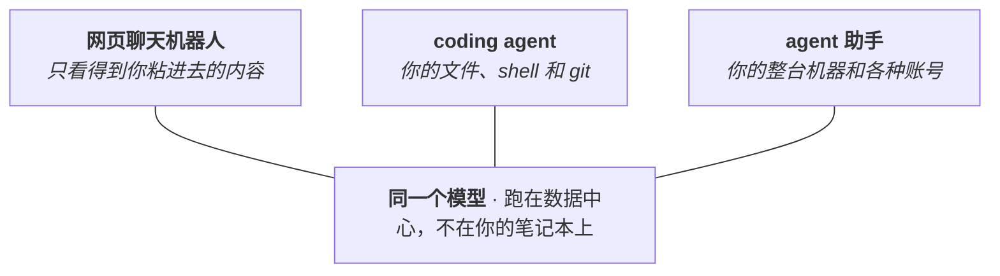

# 大语言模型与 Agent 工具应用

!!! danger "草稿 · 尚未经过人工审阅"
    本页由 AI agent 自动生成，尚未完成人工改进。在此提示移除之前，页面上的所有内容（包括引用的资料）都请当作暂定版本看待。

这一页放在整个学习路线的第一位，是有意为之。不是因为这些工具新鲜好玩，而是因为它们改变了后面所有内容的成本。一个过去意味着要跟别人的代码搏斗一星期的问题，现在可能只是一次对话，瓶颈也就从"我会不会写代码"挪到了"我懂不懂这个问题"。所以这一页是张地图：为什么这些工具值得花时间、那几个长得很像的东西到底是什么、怎么上手，以及怎么用它才不会悄悄毁掉自己的科研。

## 为什么它排第一

coding agent 是这样一个程序：你用大白话给它一个目标，它就自己去读文件、跑命令、改代码，直到目标达成或者卡住。把它和命令行、git 配在一起，终端就从一堵墙变成了一个能对话的东西。

有两点让这件事对做湿实验的人格外重要，而不只是对程序员。第一，coding agent 在任何目录里都能跑，不限于装满代码的文件夹。[Anthropic 的文档](https://code.claude.com/docs/zh-CN/common-workflows)就指出，它在一个装着笔记或手稿的文件夹里同样好使，而这个网站，包括你正在读的这一页，就是这么写出来的，过程记在[用 Claude Code 写这个网站](../7-how-to/7.1-llm-agents/7.1.1-writing-with-claude-code.md)。第二，门槛似乎真的在于理解而不在于会不会写代码。在大约 40 万次会话里，[Anthropic 发现](https://www.anthropic.com/research/claude-code-expertise)把用得好和用不好的人区分开的，是领域专业能力，而不是编程水平。这个数字来自卖工具的公司，还建立在他们自己设计的指标上。同一个信号还有个独立版本：MIT 在 2026 年 1 月围绕这些工具重做了它的[《Missing Semester》](https://missing.csail.mit.edu/2026/agentic-coding/)课程，大学做这种事，通常是因为某样东西已经不再是新鲜玩意了。

具体到这个实验室，活儿已经找上门了。2026 年年中发布的 [Claude Science](https://claude.com/product/claude-science) 内置了面向基因组学、单细胞、结构生物学的工具，还能通过 SSH 驱动 HPC 集群上的作业，用 `sbatch` 提交，而不是在登录节点上直接跑。就算你不用这个产品，它指的方向也读得出来。

这些都不代表工具已经擅长生物学了。它们还不擅长，最后一节就是对它们在哪儿会翻车的一次老实交代，也是最值得在依赖任何一句它说的话之前先看的一节。

## 三样长得很像的东西

值得早点理清的一件事：“聊天机器人”“coding agent”，以及 OpenClaw 这类东西，并不是三个抢着干同一件活的产品。它们是同一个模型穿了三件厚薄不同的外衣。模型完全一样，而且无论哪种情况，它都跑在数据中心里，不在你的笔记本上。变的是外面那层外壳（harness），也就是它能调用哪些工具、能碰你世界里的哪些东西。

*图：一个模型，三层外壳。从左到右，外壳能碰到的你的东西越来越多，而这既是能力的坐标轴，也是风险的坐标轴。*

| | 网页聊天机器人 | coding agent | agent 助手 |
| --- | --- | --- | --- |
| 举例 | claude.ai、ChatGPT | Claude Code、Codex CLI | OpenClaw |
| 外壳跑在哪 | 厂商服务器，一个浏览器标签页 | 你的机器，终端或编辑器里 | 你的机器，在后台运行 |
| 它能碰到什么 | 只有你粘进去的内容 | 你的工作目录、shell 和 git | 你整台机器和各种账号 |
| 会循环吗 | 不会，一条消息一个回复 | 会，一直调工具到把活干完 | 会，还能自己发起一轮 |
| 能撤销吗 | 没什么可撤 | 能，靠 git | 默认不能 |

这个分类值得记住，是因为同样这几条属性，既预测了能力，也预测了危险。聊天机器人删不了你的文件，因为它根本看不见；coding agent 能，而这正是为什么要在 git 里跑它：它做的每一处改动都是一段你能读、能回退的 diff。像 [OpenClaw](https://github.com/openclaw/openclaw) 这样的 agent 助手走得更远，把模型接进你的邮件、聊天和日历，于是它不用等你开每一轮就能动手。这确实是趋势所在，也是波及面最大的一类，所以它不是第一周就该上手的工具，也不适合指向存着实验室数据的那台笔记本。

底下这些概念，Simon Willison 那句[对 agent 的一句话定义](https://simonwillison.net/2025/Sep/18/agents/)（agent 就是"让大模型在一个循环里调用工具去达成目标"）和 Anthropic 的 [Building Effective Agents](https://www.anthropic.com/engineering/building-effective-agents) 是两篇最清楚的短读物。中文这边，这个视频[一口气拆穿 Skill/MCP/RAG/Agent 底层逻辑](https://www.bilibili.com/video/BV1ojfDBSEPv/)十五分钟就把同样的事讲透了，而且直冲要害：这些词人人都在用，却没人给下定义。

## 怎么上手一个

不会用终端也能开始。要是一个没有按钮的黑窗口对你就是一堵墙，桌面应用和编辑器插件能让你头一个小时完全绕开它，Anthropic 的[安装指南](https://code.claude.com/docs/zh-CN/setup)会把你引过去。[快速上手](https://code.claude.com/docs/zh-CN/quickstart)带你从安装走到第一次真正的改动，那份[新用户终端指南](https://code.claude.com/docs/zh-CN/terminal-guide)则是给从没碰过命令行的人准备的。

终端还是值得学，因为 git 和集群都住在那儿，它也是"看着 agent 干活"和"能检查它干得对不对"之间的那条线。这是单独的一页：[Linux、Git 与 GitHub 基础](1.2-linux-git.md)讲 shell 和版本控制，[Python 基础](1.3-python.md)讲实验室大部分分析所用的语言。命令行带点生物味的入门，是 Data Carpentry 的 [shell-genomics](https://datacarpentry.github.io/shell-genomics/)，里头每个例子都是真的 FASTQ 文件；中文的话，[《Missing Semester》中文版 Shell 课](https://missing-semester-cn.github.io/2020/course-shell/)和阮一峰的[《Bash 脚本教程》](https://wangdoc.com/bash/)讲的是同一片地。

一句和地域无关的实在话：能打的 coding agent 都要付费，而现在不少大学已经通过 `.edu` 邮箱发放了访问权限，自己掏钱之前值得先查一下。

## 怎么跟它好好说话

多数人从聊天机器人那儿带来的直觉，是写一条又细又全的指令然后盼着它成。对 agent 来说这基本是反的，而有两个习惯，比任何措辞技巧都更要紧。

一个是交办，而不是口述。把整个项目连同一个目标交给它，让它自己去开文件、检索、试错，而不是往框里粘几段代码再描述你想对这几段做什么。它就是在终端允许的这种四处翻看里训练出来的，你放它去看，比你一句句念给它听，能干的活多得多。

另一个是给它一样能自查的东西。agent 一看活儿像是干完了就会停，所以有个测试可跑、有个构建要过，它就会一直干到那个检查变绿，而不是把你晾成那条报错信息。就这一个习惯，换来的可靠性超过任何遣词造句的窍门。

细节看三样就够。Anthropic 的[提示最佳实践](https://platform.claude.com/docs/zh-CN/build-with-claude/prompt-engineering/overview)是最权威的参考，比你以为的短。[Claude Code 最佳实践](https://www.anthropic.com/engineering/claude-code-best-practices)那篇有前后对照的例子，还有个值得偷师的招：让 agent 先就一个任务反过来采访你，把 spec 写下来，再开工。要是你宁可学思路而不是学句式，Anthropic Academy 免费的 [AI Fluency](https://anthropic.skilljar.com/ai-fluency-framework-foundations) 课整门都围着"交办"和"判断"转，而不是教你提示词配方。任何语言里，凡是卖你一串魔法咒语的都可以跳过，在如今的模型上那类内容基本已经过时。

## 你会反复听到的几个词

有一小撮词你会一遍遍碰上。开始阶段它们都不用深钻，急着先把它们弄懂反而容易卡住。下面每个给一句话，再给一个"等这个词开始挡你路时该去哪儿"的落点。

| 概念 | 是什么 | 从这里开始 |
| --- | --- | --- |
| 模型与 effort | 跑哪个模型，以及它回答前肯下多大功夫。它明明看懂了任务还是做错，就换个更大的模型；它是马虎漏了步，就把 effort 调高。 | [选模型与 effort](https://claude.com/blog/claude-model-and-effort-level-in-claude-code) |
| 上下文窗口 | 模型一次能看到的全部内容。一次长会话会把它填满，一填满质量就往下掉。 | [Explore the context window](https://code.claude.com/docs/en/context-window) |
| Skills | 一个教 agent 一套流程的文件夹，只在用得上时才加载。现在已是好几个工具都读的通用标准。 | [agentskills.io](https://agentskills.io) |
| MCP | 把 agent 接到数据库等外部系统的一个通用接口。现由 Linux 基金会托管，不再是 Anthropic 的项目。 | [modelcontextprotocol.io](https://modelcontextprotocol.io/docs/getting-started/intro) |
| 子 agent | 一个替你在自己独立上下文里干杂活、只把摘要交回来的助手，好让主线保持干净。 | [Claude Code 文档](https://code.claude.com/docs/zh-CN/sub-agents) |

实验室自己维护着一套 Skills，打包成一个 Claude Code 插件，见[常规实验室支持](../5-lab-code/5.1-routine-support.md)。等你上手了，那儿就是工具从通用变成"懂我们数据"的地方。

## 像个科学家那样用它

把这件事学好，是为了想得更多，不是更少。授人以鱼不如授人以渔：把 agent 请进你的工作，是为了更快回答你的问题、把你没跟上的地方讲明白，而不是把推理交出去、再把它吐回来的东西原样粘上。而"这个区别是真实存在的"这一点，证据出奇地干净。在土耳其高中的一次实地实验里，用普通聊天机器人练习的学生，工具一撤，自己考得更差；而拿到一个被刻意压在"只当导师、不给答案"的版本的学生什么都没丢（[Bastani et al., *PNAS* 2025](https://pmc.ncbi.nlm.nih.gov/articles/PMC12232635/)）；另一项哈佛的试验里，那个导师式的摆法甚至比一堂组织得很好的主动学习课教得还好（[Kestin et al., *Scientific Reports* 2025](https://www.nature.com/articles/s41598-025-97652-6)）。同一个模型，是好老师还是坏拐杖，完全由你怎么把它摆好决定。实验室的习惯就是那个导师式的摆法：让它解释而不是替你产出，让它反过来考你，每一处改动留下之前先自己读一遍。

真正要留意的失败是安静的那种。agent 在猜的时候不给任何信号，一个错答案冒出来时的笃定，和一个对答案一模一样。对科学家来说，其中三个最要紧。

它在你这行里网上资料最薄的地方最弱。2026 年初的一个单细胞 RNA-seq 测试（[scBench](https://arxiv.org/abs/2602.09063)）里，碰到文档较少的实验方法，准确率会掉四十多个百分点。可以记住一个每个生物人早就带在身上的画面：带基因列表的补充 Excel 里，将近三分之一的论文有名字被弄坏的问题（[Abeysooriya et al., *PLOS Comput. Biol.* 2021](https://journals.plos.org/ploscompbiol/article?id=10.1371/journal.pcbi.1008984)），因为 *SEPT2* 悄悄变成了一个日期，而表格看上去毫无破绽。风险就长这个样子，而且它不自报。

它会顺着你。在十一个前沿模型上，agent 认同用户已表明的立场，比人认同得频繁得多，而且人们还会把这种迎合的回答评成更好的那个（[Cheng et al., *Science* 2026](https://www.science.org/doi/10.1126/science.aec8352)）。对一个抱着某个假设的学生，这是最难抓住的失败，因为被赞同的感觉，和自己是对的感觉一样。

它会编出处。凭空捏造的引用如今在已发表文献里已经能测出来，而且还在往上走，2026 年初到了大约每 277 篇 PubMed 收录的论文里就有一篇（[*The Lancet*, 2026](https://www.thelancet.com/journals/lancet/article/PIIS0140-6736%2826%2900603-3/fulltext)）。所以那个无聊的习惯反而最值得留着：每个 DOI 进文档之前先核一遍，每篇在引用之前先读一遍。

除了你自己的留意，还有两道防线。一道是你喂给它什么：未发表数据、合作者的手稿、受控访问的基因组数据，都不该进个人账号，那里的默认条款可能拿你的输入去训练。NIH 的 [NOT-OD-25-081](https://grants.nih.gov/grants/guide/notice-files/NOT-OD-25-081.html) 说得很明白，把受控访问数据交给公开 AI 工具，违反数据使用协议。另一道是你发表时会被拿什么标准要求：遵循 [ICMJE](https://www.icmje.org/recommendations/browse/artificial-intelligence/) 指南的期刊要你披露 AI 的使用，并且把你提交的一切的责任压在你身上，不在工具。生物信息学社区的 [nf-core AI 声明](https://nf-co.re/blog/2026/statement-on-ai)用一句话讲得最干脆，值得借来用：用 AI 工具的那个人，对自己提交的代码负责。

还有一句方向相反的老实话。你觉得自己更快了，这不是数据。一项随机对照试验里，经验丰富的开源开发者在自己熟悉的代码上用 AI，实测反而更慢，尽管他们做完后仍确信自己被提了速（[METR, 2025](https://metr.org/blog/2025-07-10-early-2025-ai-experienced-os-dev-study/)）。那项研究里的工具如今已经旧了，结论也有人争，但"感觉和秒表对不上"这道缝，才是留下来的部分。值得信的是那个检查，不是那个感觉。

## 延伸阅读

[Building Effective Agents](https://www.anthropic.com/engineering/building-effective-agents) 是"把 agent 搭得简单些"这个主张最好的短论，等上面那套词不再是一团雾之后读它正合适。想要一套原生中文、讲透 agent 为什么这样行事的课程，[learn.shareai.run](https://learn.shareai.run/zh/) 是目前最强的一门，不过它默认你已经会写 Python。李宏毅的 [2026 机器学习课](https://speech.ee.ntu.edu.tw/~hylee/ml/2026-spring.php)里有两讲专门讲 AI agent，正对着"科研工作正在怎样改变"这个题目。
