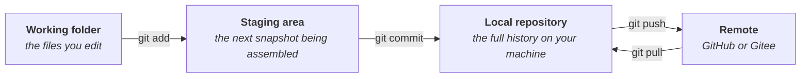

# Linux, Git & GitHub Basics

!!! danger "Draft · not yet reviewed by a human"
    An AI agent wrote this whole page. A human has not yet checked or revised
    it, so treat everything here as provisional until this notice comes down.

Three skills sit under almost everything else in this roadmap: driving a computer through typed commands, keeping a history of every change, and sharing that history with other people. They are also the three skills a coding agent leans on hardest, which quietly changes why you learn them. The point is no longer to memorize commands. It is to be able to read what the agent did, and to catch it before it does something irreversible. This page maps the basics worth learning, a small set of resources we trust, and a few places to check whether the material actually stuck. Python, the language most of this typed work is written in, gets its own page in [Python Basics](1.3-python.md).

## Why the terminal is still worth learning

Most of the lab's real computing does not happen on your laptop. Sequencing data is too big and alignment too slow, so the work runs on servers and clusters, and those machines have no desktop and no mouse. The way in is SSH, a way of logging into another computer over the network, and what greets you on the other side is a shell. Two words worth pinning down, because people mix them constantly: the terminal is the window on your screen, and the shell is the program inside it that reads what you type and runs it, usually bash or zsh. Linux is the operating system nearly all of these machines run, which is why "learning Linux" and "learning the command line" are, for our purposes, the same thing.

The payoff goes beyond remote machines. The shell's real idea is that everything is a stream of text, and small single-purpose programs can be chained with pipes so the output of one feeds the next. Counting how many reads in a FASTQ file (the raw format sequencing machines produce) contain some pattern is one line of commands, while opening that same file in an editor stops being possible at all once it reaches tens of gigabytes. And because the work is typed, it is written down. A pipeline saved in a script can be rerun, checked, and handed to someone else; a pipeline that lives in mouse clicks evaporates.

The arrival of coding agents has made all this more central, not less. Agents were trained on exactly this world of terminals and text streams, so the command line is where they are strongest, as [the previous page](1.1-llm-agents.md) describes. What becomes scarce is the ability to read commands rather than type them: knowing what `rm -rf` does before letting it run, and being able to tell whether the agent's one-liner answers the question you asked or some other question.

## Learning the shell

The order that works, in our experience, is files first, streams second, remote machines third. Start with moving around and looking at things: `ls`, `cd`, `cat`, `less`, `mkdir`, `cp`, `mv`, `rm`. Then learn to think in streams: pipes, redirection, `grep`, `wc`, and a loop for the moment you catch yourself running the same command ten times. Only then go remote with `ssh` and `scp`, which is also when the cluster stops being an abstraction. That much is honestly enough for daily lab work; scripting and the rest will suggest themselves once you are tired of retyping.

For a first course we like Data Carpentry's [shell-genomics](https://datacarpentry.github.io/shell-genomics/): it teaches exactly these skills inside a genomics project, on real FASTQ files from an E. coli variant-calling dataset, so every command comes with a reason to care. It expects the workshop's cloud setup, though, so if you want zero setup, Software Carpentry's [shell-novice](https://swcarpentry.github.io/shell-novice/) runs entirely on your own laptop with a small download and takes an afternoon. Either way, keep 阮一峰's [Bash 脚本教程](https://wangdoc.com/bash/) open on the side as the Chinese reference you look things up in. That is the whole reading list; depth can wait until a real problem asks for it.

Knowing whether it stuck is its own step, and three free sites check you at increasing levels of realism. [Linux Survival](https://linuxsurvival.com/) ends each short module with a quiz that asks you to type the right command, good for a ten-minute recall check. [cmdchallenge](https://cmdchallenge.com/) gives you one puzzle per command in a browser terminal and verifies your answer automatically, no account needed. [OverTheWire's Bandit](https://overthewire.org/wargames/bandit/) is the capstone: you log into a real server over SSH and each level's password unlocks the next, so progress is proof. Levels 0 to 15 cover the basics on this page, and being able to do them without looking things up is a solid working definition of "I know the command line."

One more suggestion, the fun kind. [Hacknet](https://store.steampowered.com/app/365450/Hacknet/) is a story-driven hacking game, cheap on Steam and officially localized into Simplified Chinese, played entirely by typing into a terminal. Its everyday commands are real Unix, `ls`, `cd`, `cat`, `rm`, `ps`, `kill`, and the campaign doubles as a tutorial that introduces them one at a time. The hacking itself is simplified fantasy and there are no pipes or permissions, so what it teaches is comfort with the terminal rather than security skills. As a way to stop being afraid of the black window, it works surprisingly well.

## Git, the lab notebook for code

Git is a version control system: it records the history of a folder as a series of commits, each one a snapshot with a message explaining why it exists. Once a project is in git, "I broke something and I don't know when" stops being scary, because every earlier state is one command away. Branches let you try an idea in a parallel draft without touching the working version. And for working with a coding agent, git is what makes delegation safe: every change the agent makes is a diff you can read and revert, which is exactly why [the previous page](1.1-llm-agents.md) insists on running agents inside git.

The mental model worth building early is that your code exists in four places at once:

*Figure: the four places a change passes through. Most confusion with git is confusion about which of these you are looking at.*

For learning, two resources cover the basics. [廖雪峰的 Git 教程](https://liaoxuefeng.com/books/git/introduction/index.html) is the standard Chinese first read: zero assumed background, command by command with screenshots, deliberately limited to the commands you actually need. Then [Learn Git Branching](https://learngitbranching.js.org/?locale=zh_CN), an interactive sandbox with an animated commit tree and a full Chinese interface. Branching and merging are where tutorials stop helping and intuition has to grow, and nothing grows it faster.

Learn Git Branching doubles as the self-check: each level shows a target commit tree and only passes when yours matches the goal, so finishing the main and remote tracks means the skill is really there. To prove it transfers to the real thing, [gitexercises.fracz.com](https://gitexercises.fracz.com/) gives you a local repository and grades your work server-side each time you run `git verify`. Those two passing you is a better signal than any amount of rereading.

## GitHub, and Gitee

GitHub is where the remote in that diagram usually lives, but it earns its place for a different reason: it is where open science happens. Nearly every tool and dataset this roadmap mentions lives there as a public repository with its code, its issues, and its discussions attached, and reading a tool's repository is a research skill in itself. The two constructs to learn are the pull request, a proposal to merge your changes into another history with room for review, and the issue, a tracked thread for a bug or a plan.

The fastest way in is GitHub's own [Hello World](https://docs.github.com/en/get-started/quickstart/hello-world), a ten-minute exercise done entirely in the browser, no installation, that walks through repository, branch, commit, and pull request. Then let [GitHub Skills](https://skills.github.com/) check you: its free courses run inside your own account and a bot reviews each step of your work automatically, so finishing the Introduction to GitHub course is itself the proof you can handle the workflow.

From mainland China, GitHub is reachable but often slow, and [Gitee](https://gitee.com/), run by OSChina, is the domestic alternative worth knowing. It speaks exactly the same git, so clone, push, branches, and pull requests all work as you would expect, and a repository can have both as remotes: push to GitHub for the world, and to Gitee for fast access at home. The honest caveats: publishing a public repository on Gitee requires passing a content review, its Pages hosting service has shut down, and the global open-source community, meaning the tools and people you will actually collaborate with, is on GitHub. Learn git and GitHub as the real skill, and treat Gitee as a fast mirror rather than a replacement.

## Learning these with an agent beside you

A coding agent changes the economics of everything on this page. It can write the `find` pipeline you half-remember, and it reads git's error messages better than most of us ever will. What it cannot do is know whether the command it just proposed is safe to run on data you cannot regenerate. So the skills worth sharpening are the supervisory ones: reading a diff before committing it, pausing at anything that deletes or overwrites, and insisting the agent work inside git so every step stays undoable.

Two habits make the pairing work well. The first is to make the agent your tutor: when it runs a command you do not know, ask it to explain the command flag by flag, or paste it into [explainshell](https://explainshell.com/). It is a patient teacher, and the explanation arrives attached to your actual problem. The second is to commit more often than feels necessary. With an agent editing at machine speed, the commit is the unit of undo, and small frequent commits are what let you say "that last idea was wrong" without losing the afternoon.

## Further reading

- [The Linux Command Line](https://linuxcommand.org/tlcl.php) by William Shotts: the book-length version of the shell section, free as a PDF, with a community Chinese translation, [快乐的 Linux 命令行](https://billie66.github.io/TLCL/). For when a real problem starts asking for depth.
- [Pro Git](https://git-scm.com/book/zh/v2): the official reference, free, in Chinese. The first three chapters cover daily life; the rest can wait.
