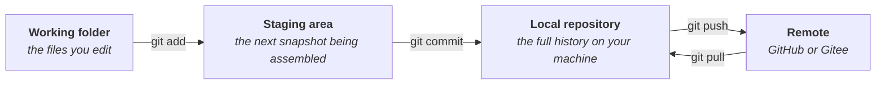

# Linux 和 Git、GitHub 基础

命令行、Git 和 GitHub 是实验室日常工作流的基础：敲命令驱动服务器上的计算，Git 记录每一次重要文件的改动，GitHub 把这份历史分享出去，变成协作。磨刀不误砍柴工，这几样加上 Python，就是我们做一切计算和分析的刀；Python 内容多，放在下一页 [Python 基础](1.3-python.md) 里单独讲。这三样恰好也是 coding agent 最依赖的技能，所以学的重点不再是背命令，而是读懂 agent 干了什么，判断它做的事情是否必要。这一页挑出值得学的基础，配几份入门材料，再给几个能检查自己是不是真会了的地方。

## 为什么终端还值得认真学

理由都很实际。第一，实验室的计算大多不在你的笔记本上：测序数据太大，比对太慢，活都在服务器和集群上跑，那些机器没有桌面也没有鼠标，用 SSH 登录进去，迎接你的就是一个 shell。第二，绝大多数生信工具根本没有图形界面，想用就得敲命令。第三，敲命令本身就是效率的来源：shell 的思路是把只干一件事的小工具用管道串起来，上一个的输出直接喂给下一个，所以"从一堆 FASTQ 文件里数出每条序列出现的次数、排出前十"这种事，在编辑器里没法做，在 shell 里只是把 `grep`、`sort`、`uniq` 串起来的一行命令。敲过的命令存进脚本，也随时可以重跑，可以原样交给别人。

有两个词经常被人混着用，值得先分清楚：终端是你屏幕上那个窗口，shell 是窗口里负责读你的命令、把它跑起来的程序，常见的是 bash 和 zsh。Linux 则是那些服务器几乎都在用的操作系统，所以对我们来说，"学 Linux"和"学命令行"基本是同一件事。

coding agent 的出现让这些事更重要了，而不是更不重要。agent 正是在终端和文本流的世界里训练出来的，命令行是它最强的主场，[上一页](1.1-llm-agents.md)已经讲过。真正变得稀缺的能力，从"会敲命令"挪到了"读得懂命令"：在放 `rm -rf` 跑之前知道它会干什么，看得出 agent 写的一行命令回答的是你问的问题，还是另一个问题。

## 学 shell 的路径

按我们的经验，顺序是先文件，再文本流，最后远程机器。先学怎么走动和看东西：`ls`、`cd`、`cat`、`less`、`mkdir`、`cp`、`mv`、`rm`。然后学会用流的方式思考：管道、重定向、`grep`、`wc`，以及在你发现自己同一条命令敲了十遍的时候，学一个循环。再然后才是用 `ssh` 和 `scp` 上远程机器，到这一步，集群就不再是个抽象概念了。到这儿为止，应付实验室的日常工作其实已经够了；写脚本之类的事，也就是把一串命令存进一个文件、让 shell 照着从头跑到尾，等你重复敲烦了，自然会觉得需要它。

第一门课我们推荐 Data Carpentry 的 [shell-genomics](https://datacarpentry.github.io/shell-genomics/)：它教的正是上面这套东西，但放在一个基因组学项目里，用的例子全是大肠杆菌变异检测数据里的真 FASTQ 文件，每条命令都对着一个真问题。不过它预设了工作坊的云端环境，要自己折腾一番才能跟上；想零准备、在自己笔记本上直接开始的话，可以选 Software Carpentry 的 [shell-novice](https://swcarpentry.github.io/shell-novice/)，下载一份小数据，一个下午过完。不管跟哪门课，旁边都建议开着阮一峰的[《Bash 脚本教程》](https://wangdoc.com/bash/)当中文参考书，随查随用。偏好听课胜过动手跟练的话，MIT《Missing Semester》的 [Shell 课](https://missing-semester-cn.github.io/2020/course-shell/)有社区翻译的中文版，把同样的内容浓缩成几讲，信息密度高，适合跟完一门课之后回头快速串一遍。要读的就这些，深度等真问题来敲门的时候再说。

学没学会，得有地方检查，这三个免费网站按真实程度由低到高给你把关。[Linux Survival](https://linuxsurvival.com/) 每个短模块结尾有个小测，让你敲出正确的命令，适合十分钟的回忆式自测。[cmdchallenge](https://cmdchallenge.com/) 在浏览器终端里一题考一条命令，答案自动判对错，不用注册。[OverTheWire 的 Bandit](https://overthewire.org/wargames/bandit/) 是压轴：通过 SSH 登上一台真实的服务器，每一关的密码就是下一关的门票，能往前走本身就是证明。前 15 关正好覆盖这一页讲的基础，不看答案把它们过完，"命令行我会了"这句话就有了一个很硬的标准。

还有一个建议，属于好玩的那类。[Hacknet](https://store.steampowered.com/app/365450/Hacknet/) 是一个剧情驱动的黑客游戏，Steam 上很便宜，自带官方简体中文，整个游戏就是对着终端敲命令来玩。它日常用的命令都是真的 Unix 命令，`ls`、`cd`、`cat`、`rm`、`ps`、`kill`，而且剧情本身就是教程，把命令一个一个介绍给你。不过里面的黑客环节是简化过的想象，也没有管道和权限那一套，所以它教的是对终端的熟悉感，不是真的安全技术。单说消除对黑色窗口的恐惧，它的效果好得出奇。

## Git，代码的实验记录本

git 是一个版本控制系统：它把一个文件夹的历史记成一串 commit，每个 commit 是一份快照，附带一句话说明这次改动为什么存在。项目一旦进了 git，"我把东西改坏了，还不知道是哪一步坏的"就不再可怕，因为任何早先的状态都只要一条命令就能回去。branch（分支）让你把一个新想法放进平行的草稿里试，不碰正在用的版本。而跟 coding agent 协作时，git 是让"交办"变得安全的那块地基：agent 的每一处改动都是一个 diff，你可以逐行读，也可以一键退回。[上一页](1.1-llm-agents.md)坚持要在 git 里跑 agent，原因就在这里。

值得尽早建立的直觉是：你的代码同时住在四个地方。

*图：一次改动依次经过的四个地方。用 git 时的大多数困惑，其实都是搞混了自己正在看哪一个。*

学习资料，两份就够覆盖基础。[廖雪峰的 Git 教程](https://liaoxuefeng.com/books/git/introduction/index.html)是中文世界标准的入门读物：零背景假设，一条命令一条命令地讲，配截图，而且刻意只讲你真正用得上的那些命令。然后是 [Learn Git Branching](https://learngitbranching.js.org/?locale=zh_CN)，一个交互式沙盘，提交历史画成动画，有完整中文界面。分支和合并恰恰是教程帮不上忙、只能靠直觉的地方，养这个直觉没有比它更快的。

Learn Git Branching 同时就是自查工具：每一关给一棵目标提交树，你的树和目标对上才算过关，所以把主线和远程两个部分通关，本身就说明技能真的长在手上了。想再证明它在真实的 git 上也作数，[gitexercises.fracz.com](https://gitexercises.fracz.com/) 会在你本地克隆的仓库里出题，每次跑 `git verify` 都由服务器判分。这两个工具给你放行，比把教程重读几遍更能说明问题。

## GitHub，以及 Gitee

GitHub 是上面那张图里 remote 通常所在的地方，但它真正重要的理由在别处：开放科学发生在那里。这份路线里提到的几乎每一个工具和数据集，都以公开仓库的形式住在 GitHub 上，代码、issue、讨论都挂在旁边。会读一个工具的仓库，它的 README、它的 issue 区，本身就是一项研究技能。要学的概念有两个：pull request，把"请把我的改动合并进你的历史"打包成一份可以评审的提案；以及 issue，一条围绕某个 bug 或计划的、可持续跟踪的讨论串。

读到这里，如果还没有账号，先去 GitHub 和 Gitee 各注册一个，下面的练习都要在自己的账号里做。最快的入口是 GitHub 官方的 [Hello World](https://docs.github.com/en/get-started/quickstart/hello-world)，十分钟的练习，全程在浏览器里做，不用装任何东西，把仓库、分支、commit、pull request 走一遍。然后让 [GitHub Skills](https://skills.github.com/) 来检查你：它的免费课程直接在你自己的账号里进行，机器人会自动评审你每一步的操作，所以完成 Introduction to GitHub 这门课，本身就是"这套流程我能走下来"的证明。

从国内访问 GitHub 能用，但常常很慢，开源中国运营的 [Gitee](https://gitee.com/) 是值得知道的国内方案。它说的是完全一样的 git 语言，clone、push、分支、pull request 都和你预期的一样工作，而且一个仓库可以同时挂两个 remote：同一份代码，一份推给 GitHub 面向世界，一份推给 Gitee 方便国内快速访问。有几句实话也要讲：在 Gitee 上把仓库设为公开需要通过内容审核，它的 Pages 静态托管服务已经下线，而全球的开源社区，也就是你真正会打交道的那批工具和同行，都在 GitHub 上。所以把 git 和 GitHub 当作要学的真本事，把 Gitee 当作一面访问更快的镜子，而不是替代品。

还有一个官方工具值得装：[GitHub CLI](https://cli.github.com/)（命令是 `gh`），它把 GitHub 的操作搬进了终端，克隆仓库、看 issue、开 pull request、查 CI 状态都不用再开浏览器。装好之后跑一次 `gh auth login` 登录，这件事的意义不止于你自己少点几下鼠标：登录是一次性的，从那以后 coding agent 就能以你的身份跑 `gh`，绝大多数 git 加 GitHub 的工作，从建仓库、推代码到开 PR、回 issue，都可以交给它做，你在旁边看它跑命令就行。Gitee 这边目前没有官方的对应工具，好消息是日常最重的操作（clone、push、pull）用的本来就是标准 git，agent 一样能替你做，只有 issue、PR 这类平台功能需要回到浏览器。

!!! tip "小提示"
    这一页提到的工具，不管是 `gh` 还是延伸阅读里的 Oh My Zsh、iTerm2，安装都可以直接用自然语言交代给 coding agent，一句"帮我装好这个"，下载、安装、配置它都会搞定。这正是我们把 agent 放在整个路线[第一页](1.1-llm-agents.md)的原因。

## 有 agent 陪在旁边，这些怎么学

coding agent 改变了这一页所有内容的投入产出比。你记不太全的 `find` 管道，它能随手写出来；git 的报错信息，它比我们大多数人都读得熟。它做不到的是判断：它刚提议的这条命令，跑在你无法再生的数据上安不安全。所以值得持续打磨的是那些监督性的技能：提交之前读懂 diff，遇到删除或覆盖的操作先停一拍，以及坚持让 agent 在 git 里干活，让每一步都可以撤销。

有两个习惯能让这种配合运转良好。一是把 agent 当成家教：它跑了你没见过的命令，就让它一个参数一个参数地讲给你听，或者把命令粘进 [explainshell](https://explainshell.com/)。它是个耐心的老师，而且讲解正好落在你眼前的真问题上。二是 commit 得比直觉需要的更勤。agent 以机器的速度改东西，commit 就是撤销的最小单位，小而频繁的 commit，才能让你说出"刚才那个思路不对"的时候，不用赔上一整个下午。

## 延伸阅读

- William Shotts 的 [The Linux Command Line](https://linuxcommand.org/tlcl.php)：shell 那部分的书本长度版本，PDF 免费，有社区翻译的中文版[《快乐的 Linux 命令行》](https://billie66.github.io/TLCL/)。等真问题开始要求深度的时候读它。
- [Pro Git](https://git-scm.com/book/zh/v2)：官方参考书，免费，中文。前三章覆盖日常，剩下的可以先放着。
- 码农高天的[《十分钟学会正确的 GitHub 工作流》](https://www.bilibili.com/video/BV19e4y1q7JJ)（B 站）：一个专业程序员讲开源作者们实际使用的工作流，怎么一步步把代码维护起来。
- [Oh My Zsh](https://ohmyz.sh/)：zsh 的配置框架，装上就有了好看的主题、更强的补全和一大把现成插件，终端会好用很多。
- [iTerm2](https://iterm2.com/)：macOS 上替代自带终端的选择，分屏、搜索、快捷键都强得多；Windows 上对应的是微软自家的 [Windows Terminal](https://aka.ms/terminal)。
