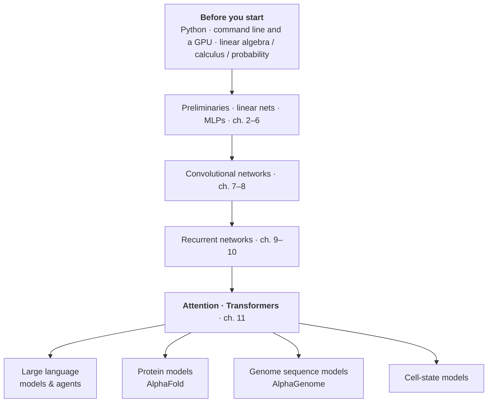

# Deep Learning Basics

Is deep learning worth sitting down and learning properly? The lab's answer is yes, though probably not the way you'd picture it. What follows: why it's worth the time, what to have in place first, which course to follow, and where it connects onwards.

## Why it's worth learning

Here's a situation that comes up fast. You open an AI-plus-biology paper, get to the methods, and the authors write that they fine-tuned a pre-trained model. That's the whole explanation. No definition of pre-training, no reason given for fine-tuning, because to them it's common knowledge. Papers in this field are dense with that vocabulary: embedding, loss function, overfitting, attention. Without those words the methods section becomes something to skip, and the methods are usually the part most worth reading.

The second reason is more practical. Most of the time we're not training models from scratch, we're using someone else's: running a structure prediction, scoring a batch of variants. The awkward part is that a model never announces when it's guessing. Hand it a sequence unlike anything in its training data and it still returns a number, formatted exactly like a correct answer. Working out whether that number deserves trust means knowing what data it saw, what objective it optimised, and where its competence runs out. That question comes up far more often in day-to-day work than writing training code does.

One more thing, and this one is reassuring. The foundations here are steadier than you'd expect. Take apart a 2026 frontier model and you still find the same parts people invented between 2015 and 2017, rearranged. What you learn over the next couple of months won't expire.

*Figure: the map for this page. Three prerequisites feed into the D2L trunk, which branches into the model families the lab works on.*

## Before you start

Not much preparation. Enough Python to write functions and classes and push arrays around with NumPy. Enough command line to ssh into a machine, set up an environment, and get a notebook running. For maths: linear algebra as in knowing what matrix multiplication does, calculus as in derivatives and the chain rule, probability as in distributions and expectations. That's roughly the bar.

A note on GPUs, since it trips people up: none of this requires getting hold of a server first. The models in most of D2L are small enough for a laptop with a discrete GPU, and Google Colab's free tier covers you without one. Cluster time can wait until there's something big to train.

Maths is where people get stuck. The thought "shouldn't I take a semester of linear algebra first" occurs to almost everyone. D2L's preface is explicit that it assumes only basic linear algebra, calculus, probability, and very basic Python, and chapter 2 re-teaches the maths it actually uses. Filling gaps as you go works fine.

!!! tip "Self-check: ready enough?"
    You can read a chunk of NumPy and say what `A @ B` computes. You know what taking a derivative means geometrically and you've heard of the chain rule. You can ssh into a machine and get a Python script running. If those three roughly match, this is a fine time to start; if one is a long way off, that one first will make the rest smoother.

## Following D2L

[*Dive into Deep Learning*](https://d2l.ai/) (D2L) has essentially no competition as a starting point. It's a book, but every section is a runnable Jupyter notebook, and it's used as a textbook at over 500 universities. The companion video course walks through the material section by section, writing out the PyTorch line by line next to the ideas, though the lectures are in Chinese only.

Worth saying explicitly: even without doing deep learning research, if you're going to use deep learning models then this material is hard to route around.

| Resource | What it's for |
| --- | --- |
| [English book](https://d2l.ai/) | Main text; also has chapters the Chinese edition lacks, on reinforcement learning, Gaussian processes and hyperparameter optimisation |
| [GitHub](https://github.com/d2l-ai/d2l-en) | Source; clone this to run the code locally |
| [Discussion forum](https://discuss.d2l.ai/) | A question thread for every single section |
| [Course site](https://courses.d2l.ai/zh-v2/) | Per-lecture PDF slides and notebooks (in Chinese) |
| [Video lectures](https://space.bilibili.com/1567748478/lists/358497?type=series) | 80-plus sessions by Mu Li, in Chinese |
| [Exercise solutions](https://datawhalechina.github.io/d2l-ai-solutions-manual/) | Community-maintained, for when you're stuck (in Chinese) |

The chapters don't need equal effort, though stopping too early is a common regret. Chapters 1 to 6 lay the groundwork. Chapters 7 to 11 cover four model families, multilayer perceptrons, convolutional neural networks and recurrent neural networks, arriving at attention. Chapter 11 is the hinge of the whole book and the ten before it are groundwork for it.

Plenty of people wrap up right there, and there's more worth having. Chapters 12 to 14 cover optimisation and computational performance, which are exactly the problems that show up daily once you train something yourself: setting a learning rate, running out of GPU memory, using more than one card. Chapters 15 and 16 on NLP give the history that led up to LLMs. You see how the BERT generation framed the problem, which is what makes it clear what the GPT series actually changed.

<!-- noglossary -->
<figure class="tier-map">
  

    
<strong>Groundwork</strong>ch. 1–6

    
Introduction · Preliminaries · Linear networks · Multilayer perceptrons · Builders' guide

  

  

    
<strong>Four model families</strong>ch. 7–11

    
Convolutional networks · Modern CNNs · Recurrent networks · Modern RNNs · <em>Attention and Transformers</em>

  

  

    
<strong>Training your own</strong>ch. 12–14

    
Optimisation algorithms · Computational performance · Computer vision

  

  

    
<strong>NLP before LLMs</strong>ch. 15–16

    
NLP: pretraining · NLP: applications

  

  <figcaption>How to read D2L. The first eleven chapters are the trunk; what follows isn't optional, it just serves a different purpose.</figcaption>
</figure>
<!-- /noglossary -->

One gap D2L does leave: it never really covers the GPT-1, 2, 3 line. Karpathy fills that in. See the further reading below.

The order for any one section goes like this: watch the video, run the notebook, then change a hyperparameter and watch it break. Raise the learning rate tenfold, halve the layers, switch off the regularisation, then account for what you saw. Step three takes the longest and teaches the most; the first two make it very easy to feel like you've learned something.

The "from scratch" sections are worth the time. They look like busywork, since the very next section redoes the same thing in a few lines of framework code. But they're one of the rare chances to take backpropagation and gradient descent apart by hand, and skipping them tends to leave both as black boxes, along with whatever automatic differentiation was doing on your behalf.

The course comes with four Kaggle competitions, and finishing one properly is worth a lot. The gap between "I ran someone else's notebook" and "I'm looking at data nobody cleaned for me" only closes by crossing it once.

On timing: the trunk is chapters 1 to 11, and at two or three sections a week that's roughly two to three months.

## Where it goes from here

Those chapters are a junction, and every direction the lab cares about grows out of them.

The Transformer in chapter 11 is the T in GPT, and BERT gets a full section in chapter 15. Read both, add Karpathy's two videos, and large language models stop being a black box. That thread continues at [LLMs & Agent Tools](../1-basics/1.1-llm-agents.md).

AlphaFold's core module is a variant of attention that attends over pairs of residues rather than words in a sentence, which leads to [Protein Models](4.4-protein-models.md). Enformer and AlphaGenome are built from convolutions that recognise local sequence patterns plus attention that links a regulatory element to a gene hundreds of kilobases away, so chapters 7 and 8 plus chapter 11, leading to [Genome Sequence Models](4.3-genome-sequence-models.md). And [Cell-State Models](4.5-cell-state-models.md) treat a cell as a sentence and its genes as words, carrying the whole language-model playbook across.

Four fields to read about, one box of parts to learn.

## Further reading

[3Blue1Brown's neural network series](https://www.3blue1brown.com/topics/neural-networks) is four short films that turn neural networks, gradient descent and backpropagation into things you can see. Good before starting D2L, or to come back to when the maths stalls you.

Karpathy's two videos fill the gap D2L leaves. [Let's build GPT](https://www.youtube.com/watch?v=kCc8FmEb1nY) hand-writes a character-level GPT from nothing in about two hours. [Deep Dive into LLMs like ChatGPT](https://www.youtube.com/watch?v=7xTGNNLPyMI) runs three and a half hours and goes from pre-training all the way to RLHF; it's the clearest account of the modern LLM training stack I know of.

*Deep Learning* by Goodfellow et al., [the flower book](https://www.deeplearningbook.org/), works better as a reference than a read-through. Look up the chapter when you want to dig into one concept.
