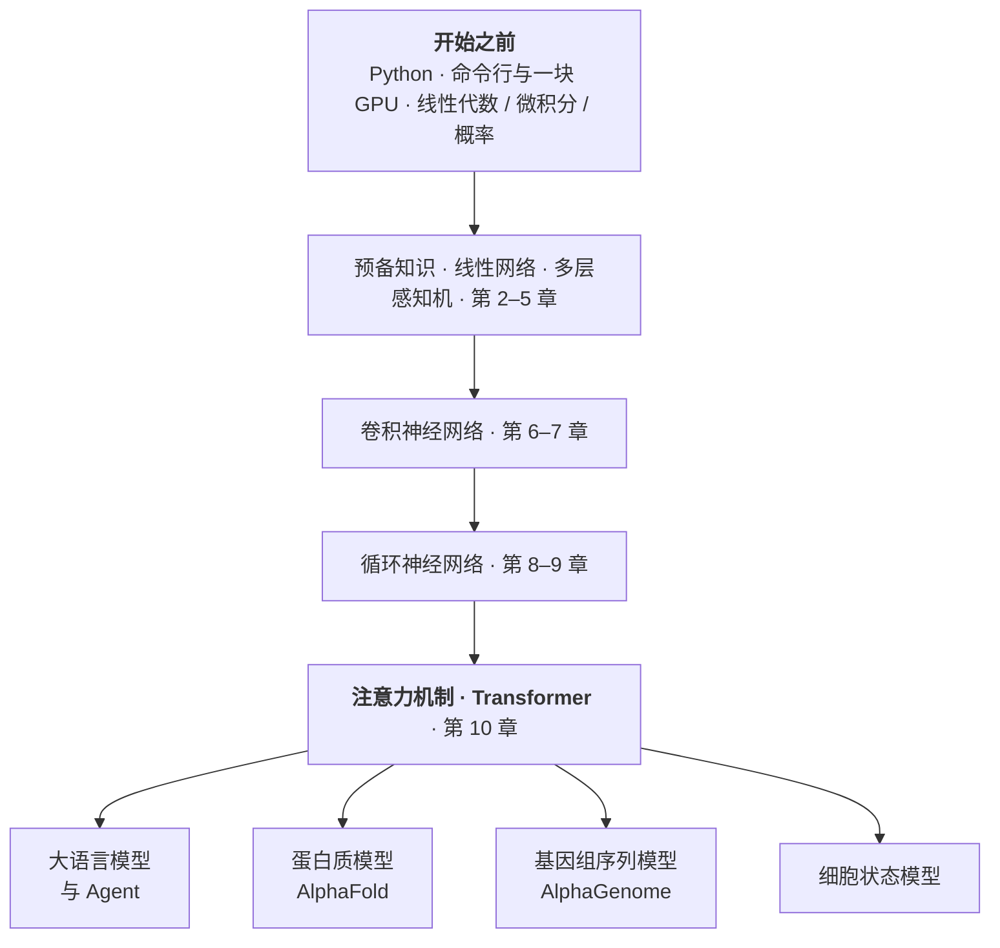

# 深度学习基础

深度学习要不要专门花时间学一遍？这一页是实验室的建议：值得，不过学法可能和想象中不太一样。下面写的是为什么值得、开始之前要会点什么、跟着哪门课走，以及学完之后能接到哪里去。

## 为什么值得学

先说一个很快就会遇到的场景。打开一篇 AI 加生物的论文，翻到方法部分，作者写"我们在预训练模型上做了微调"，然后就没有然后了。他不解释什么叫预训练，也不解释为什么要微调，因为在他眼里这属于常识。这类词在这个领域的论文里密度很高：嵌入、损失函数、过拟合、注意力机制。不认识它们，方法部分基本只能跳过去，而方法部分往往是一篇论文里最值得读的地方。

第二个理由更实际一些。多数时候我们不会自己从头训练模型，而是用别人训好的：跑一次结构预测，给一批变异打个分。麻烦在于，模型不会告诉你它什么时候在瞎猜。碰到没见过的序列，它照样吐出一个分数，格式和真实结果一模一样。要判断这个分数值不值得信，得知道它拿什么数据训的、优化的是什么目标、什么情况超出了它的能力范围。这件事在日常工作里出现的频率，比自己写训练代码高得多。

还有一点：这个领域的地基比想象中稳定。2026 年最前沿的那些模型，拆开看还是 2015 到 2017 年那几样零件的重新组合。现在花两三个月学的东西，两年后不会作废。

*图：这一页的地图。三样前置知识汇入 D2L 的主干，主干再分叉成实验室几个具体的模型方向。*

## 开始之前

准备工作不多。Python 会写函数和类、用 NumPy 处理过数组就够；命令行能 ssh 到一台机器上，装好环境，把 notebook 跑起来。数学方面，线性代数知道矩阵乘法在干什么，微积分知道导数和链式法则，概率知道分布和期望，差不多就可以了。

顺带说一句 GPU：学这个不一定要先搞到一台服务器。D2L 前大半本书的模型都很小，一台带独立显卡的笔记本跑得动，手头没有显卡的话 Colab 的免费额度也够折腾。等真要训大模型了再去申请集群也来得及。

数学是最容易让人卡住的一环。"是不是得先补一学期线代"这个念头大概每个人都有过，实际上 D2L 的前言写得很明白：它只假设读者了解基础的线性代数、微积分、概率和很基础的 Python 编程，而且第 2 章会把后面真正用到的数学重新讲一遍。缺的部分边学边补就行。

!!! tip "自测：够不够？"
    能读懂一段 NumPy 代码，知道 `A @ B` 在算什么；知道求导在几何上是什么意思，听说过链式法则；能 ssh 到一台机器上把 Python 脚本跑起来。这三条大致对得上就可以开始了，某一条差得比较远的话，先补那一条会顺一些。

## 跟着 D2L 走

[《动手学深度学习》](https://zh.d2l.ai/)（简称 D2L）在中文世界里几乎没有对手。它是一本书，但每一节都是能直接跑的 Jupyter notebook；配套的 B 站视频由李沐一节一节讲下来，讲清模型思想的同时把 PyTorch 实现一行行写出来。中英文版被全球五百多所大学拿去当教材。

值得说明的是，就算不做深度学习研究、只是需要用到深度学习模型，这门课里的内容基本也是绕不开的。

| 资源 | 用途 |
| --- | --- |
| [中文书](https://zh.d2l.ai/) | 主教材，每节都可运行 |
| [B 站视频](https://space.bilibili.com/1567748478/lists/358497?type=series) | 李沐逐节讲解，共八十余讲 |
| [课程主页](https://courses.d2l.ai/zh-v2/) | 每讲的 PDF 讲义和 notebook |
| [GitHub](https://github.com/d2l-ai/d2l-zh) | 源码，本地跑代码从这里克隆 |
| [官方讨论区](https://discuss.d2l.ai/) | 每一节都有对应的提问帖 |
| [习题解答](https://datawhalechina.github.io/d2l-ai-solutions-manual/) | Datawhale 社区整理，卡住时对答案 |
| [英文书](https://d2l.ai/) | 章节更多，多出强化学习、高斯过程、超参数优化等 |

十六章不必平均用力，也不太建议停得太早。第 1 到 5 章打底；第 6 到 10 章讲四类模型，多层感知机、卷积神经网络、循环神经网络，最后落到注意力机制。第 10 章是全书的枢纽，前面九章都在为它铺路。

不少人读到第 10 章就收工了，其实后面还有值得读的部分。第 11 到 13 章讲优化算法和计算性能，这些正是真要自己训一个模型时每天都会撞上的问题：学习率怎么调，显存不够怎么办，多卡怎么用。第 14、15 章的自然语言处理给了 LLM 出现之前的历史背景，能看到 BERT 那一代人怎么想问题，也就明白了 GPT 系列究竟改了什么。

<!-- noglossary -->
<figure class="tier-map">
  

    
<strong>打底</strong>第 1–5 章

    
引言 · 预备知识 · 线性神经网络 · 多层感知机 · 深度学习计算

  

  

    
<strong>四类模型</strong>第 6–10 章

    
卷积神经网络 · 现代卷积网络 · 循环神经网络 · 现代循环网络 · <em>注意力机制与 Transformer</em>

  

  

    
<strong>自己训模型</strong>第 11–13 章

    
优化算法 · 计算性能 · 计算机视觉

  

  

    
<strong>LLM 之前的 NLP</strong>第 14–15 章

    
自然语言处理：预训练 · 自然语言处理：应用

  

  <figcaption>D2L 的读法。前十章是主干，第 11 章之后不是可选内容，只是各自服务于不同目的。</figcaption>
</figure>
<!-- /noglossary -->

有一块 D2L 确实没覆盖：GPT-1、2、3 这条线它没细讲。这部分可以看 Karpathy，见文末的延伸阅读。

学一节的顺序大致是：看视频，把 notebook 跑一遍，然后改一个超参数看它怎么坏掉。学习率调大十倍，层数砍一半，正则项关掉，再解释一下看到的现象。第三步最花时间也最有用，前两步很容易产生"已经学会了"的错觉。

"从零开始实现"那些小节值得花时间。它们看着像重复劳动，因为紧接着就有一节用几行框架代码做同样的事。但那是少有的一次亲手把反向传播和梯度下降拆开看的机会，跳过去的话它们大概会一直是个黑箱，也不太会知道自动微分到底替我们做了什么。

课程配了四场 Kaggle 竞赛，挑一场认真做完收获会大很多。从"跑通了别人的 notebook"到"面对一份没人整理过的数据"，这中间的落差只能靠亲自做一次补上。

时间上，主干第 1 到 10 章，每周两三节的话大概两三个月。

## 学完之后往哪儿走

这十章是个分叉口，实验室关心的几个方向都从这里长出来。

第 10 章的 Transformer 就是 GPT 里的那个 T，BERT 在第 14 章有完整一节。把这两处读完，再补上 Karpathy 的两个视频，大语言模型基本就不是黑箱了。这条线接 [大语言模型与 Agent 工具应用](../1-basics/1.1-llm-agents.md)。

AlphaFold 的核心模块是注意力的一个变体，只不过它注意的不是句子里的词，而是序列上的残基对，往下走是 [蛋白质模型](4.4-protein-models.md)。Enformer、AlphaGenome 这一类的骨架则是卷积负责认出局部序列模式、注意力负责把几十万碱基外的调控元件和基因连起来，正好是第 6、7 章加第 10 章，往下走是 [基因组序列模型](4.3-genome-sequence-models.md)。至于 [细胞状态模型](4.5-cell-state-models.md)，思路是把一个细胞当成一个句子、把基因当成词，于是整套语言模型的做法就搬了过来。

读起来是四个领域，拆开是同一个零件箱。

## 延伸阅读

[3Blue1Brown 神经网络系列](https://space.bilibili.com/88461692)（中文频道，四集短片）把神经网络、梯度下降、反向传播画成了看得见的东西。适合在啃 D2L 之前先看一遍，或者被数学卡住的时候回来看。

Karpathy 的两个视频补上 D2L 缺的那块，都是英文。[Let's build GPT](https://www.youtube.com/watch?v=kCc8FmEb1nY) 从零手写一个字符级 GPT，两小时；[Deep Dive into LLMs like ChatGPT](https://www.youtube.com/watch?v=7xTGNNLPyMI) 三个半小时，从预训练一路讲到 RLHF，是目前把现代 LLM 训练全流程讲清楚的最好材料。

花书《深度学习》有[中文翻译](https://github.com/exacity/deeplearningbook-chinese)，也有[英文原版](https://www.deeplearningbook.org/)。这本更适合当工具书查，想深挖某个概念时翻对应那一章，通读的性价比不高。
